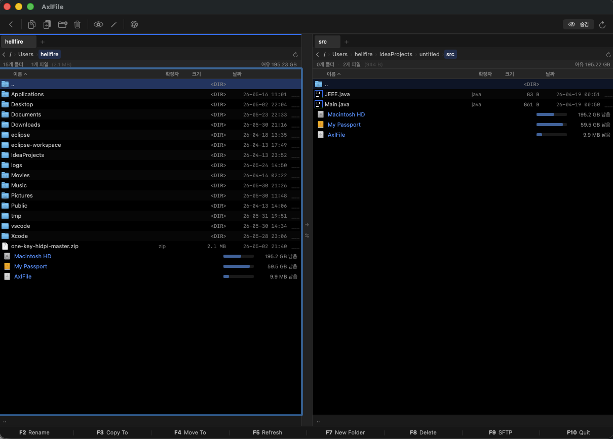

# AxlFile

macOS용 듀얼패널 파일 매니저. 키보드 중심 인터페이스를 제공합니다.



## 주요 기능

- **듀얼패널** — 좌우 패널을 드래그로 크기 조절, Tab 키로 패널 전환
- **멀티탭** — 패널별 여러 탭 지원
- **가변 컬럼** — 파일 수에 따라 1~4열 자동 전환
- **SFTP 지원** — SSH 기반 원격 서버 접속 및 파일 전송
- **파일 작업** — 복사, 이동, 삭제, 이름 변경, 새 파일/폴더 생성
- **드라이브 목록** — 마운트된 볼륨을 파일 목록 하단에 표시
- **파일 뷰어** — 텍스트/이미지 미리보기

## 요구사항

- macOS 14.0 이상
- Xcode 15 이상 (빌드 시)

## 빌드

```bash
git clone https://github.com/hellfire7707/AxlFile.git
cd AxlFile
open AxlFile.xcodeproj
```

Xcode에서 `Cmd+R`로 실행.

## 키보드 단축키

| 키 | 동작 |
|----|------|
| `↑` / `↓` | 파일 이동 |
| `Enter` | 폴더 진입 / 파일 열기 |
| `Backspace` | 상위 폴더로 이동 |
| `Tab` | 반대 패널로 포커스 이동 |
| `Space` | 파일 선택/해제 |
| `Shift + ↑↓` | 범위 선택 |
| `Shift + Home/End` | 처음/끝까지 선택 |
| `Cmd + A` | 전체 선택 |
| `F2` | 이름 변경 |
| `F3` | 반대 패널로 복사 |
| `F4` | 반대 패널로 이동 |
| `F5` | 새로고침 |
| `F7` | 새 폴더 |
| `F8` | 삭제 |
| `F9` | SFTP 연결 |
| `Cmd+N` | 새 파일 |
| `Cmd+T` | 새 탭 |
| `Cmd+W` | 탭 닫기 |

## 라이선스

Copyright © 2025 [axlrator.co.kr](https://axlrator.co.kr)
